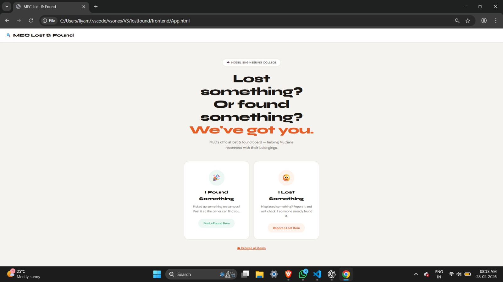
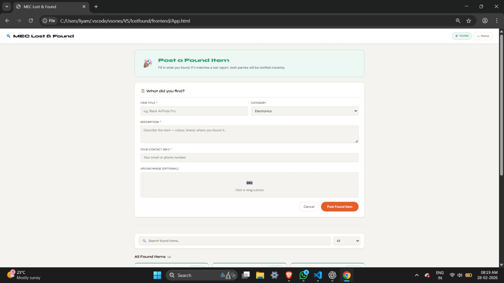
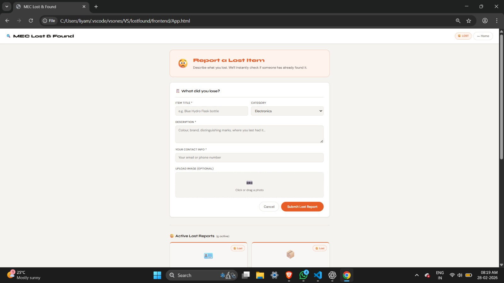
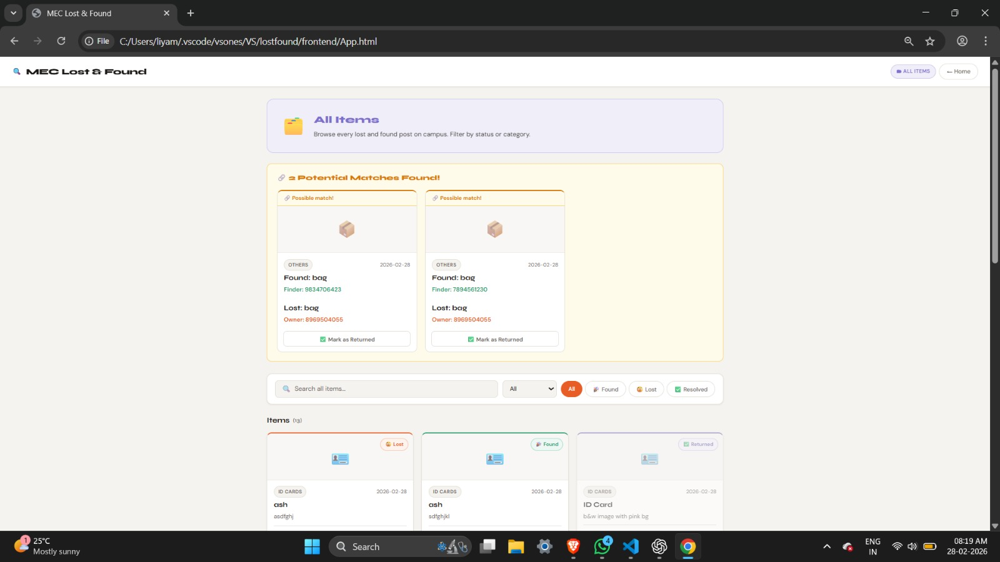

# 🔍 MEC Lost & Found

A full-stack web app for Model Engineering College students to report lost items and post found items. Features automatic match detection to reunite owners with their belongings.

---

## 🛠️ Tech Stack

- **Frontend:** HTML, CSS, JavaScript
- **Backend:** Node.js, Express
- **Database:** MongoDB
- **Image Upload:** Multer
- **Dev Tools:** Nodemon, VS Code Live Server

---

## ✨ Features

- 📢 Post found items with optional photo upload
- 😟 Report lost items with description and contact info
- 🔗 Automatic match detection between lost and found posts
- ✅ Mark items as returned/resolved
- 🔎 Search and filter by category and status
- 📬 Direct contact between finder and owner
- 🗂️ Browse all items in one place

---

## 📸 Screenshots

| Home Page | Post Found Item |
|-----------|----------------|
|  |  |

| Report Lost Item | All Items & Matches |
|-----------------|---------------------|
|  |  |

---

## 🎥 Demo Video

> [Click here to watch the demo](#)  
>
](https://drive.google.com/file/d/1MoTljM15HqeW2f5ewB4R0zq6oTQW5UXJ/view?usp=sharing)
---

## 🏗️ Architecture Diagram

```
┌─────────────────────────────────────────────┐
│               Browser                        │
│           (frontend/App.html)                │
│    - Posts forms via fetch() API calls       │
│    - Displays items loaded from MongoDB      │
└───────────────────┬─────────────────────────┘
                    │  HTTP (port 5500)
                    ▼
┌─────────────────────────────────────────────┐
│           Express Server (port 5000)         │
│              backend/server.js               │
│  - CORS middleware                           │
│  - Serves uploaded images as static files   │
│  - Routes requests to itemRoutes.js         │
└───────────────────┬─────────────────────────┘
                    │  Mongoose ODM
                    ▼
┌─────────────────────────────────────────────┐
│             MongoDB Database                 │
│          (lostfound / items)                 │
│  - Stores all lost & found item documents   │
│  - Persists across sessions                  │
└─────────────────────────────────────────────┘
```

---

## ⚙️ Installation

**Prerequisites:** Node.js, MongoDB Community Server

```bash
# 1. Clone the repository
git clone https://github.com/li-yah-h/lost-found-app.git
cd lost-found-app

# 2. Install backend dependencies
cd backend
npm install

# 3. Set up environment variables
cp .env.example .env
```

Open `.env` and add:
```env
MONGO_URI=mongodb://localhost:27017/lostfound
PORT=5000
```

---

## ▶️ Run

```bash
# Start backend
cd backend
npm run dev
```

Open `frontend/App.html` with **Live Server** in VS Code.

App runs at:
- Frontend → `http://127.0.0.1:5500`
- Backend  → `http://localhost:5000`

---

## 📡 API Docs

Base URL: `http://localhost:5000`

| Method | Endpoint | Description | Body |
|--------|----------|-------------|------|
| `GET` | `/api/items` | Get all items | — |
| `GET` | `/api/items/:id` | Get single item | — |
| `POST` | `/api/items` | Create new item | `multipart/form-data`: title, description, category, status, contact, image (optional) |
| `PATCH` | `/api/items/:id` | Update item status | `{ "status": "Resolved" }` |
| `DELETE` | `/api/items/:id` | Delete item | — |

**Example POST body (form-data):**
```
title        = Black AirPods Pro
description  = Found near library entrance
category     = Electronics
status       = Found
contact      = student@mec.ac.in
image        = (optional file upload)
```

---

## 👥 Team Members

| Name | Role |
|------|------|
| Liya Mary Paul | Backend Developer |
| Jaliba Nasrin O | Frontend Developer |


---

## 📄 License

This project is licensed under the [MIT License](LICENSE).
